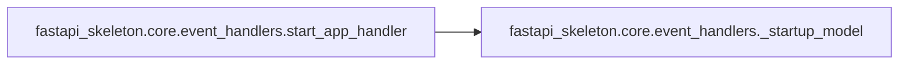
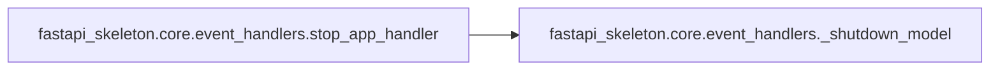

# Fastapi Skeleton Core

[_Documentation generated by Documatic_](https://www.documatic.com)

<!---Documatic-section-Codebase Structure-start--->
## Codebase Structure

<!---Documatic-block-system_architecture-start--->
```mermaid
None
```
<!---Documatic-block-system_architecture-end--->

# #
<!---Documatic-section-Codebase Structure-end--->

<!---Documatic-section-fastapi_skeleton.core.event_handlers._startup_model-start--->
## fastapi_skeleton.core.event_handlers._startup_model

<!---Documatic-section-_startup_model-start--->
<!---Documatic-block-fastapi_skeleton.core.event_handlers._startup_model-start--->
<details>
	<summary><code>fastapi_skeleton.core.event_handlers._startup_model</code> code snippet</summary>

```python
def _startup_model(app: FastAPI) -> None:
    model_path = DEFAULT_MODEL_PATH
    model_instance = HousePriceModel(model_path)
    app.state.model = model_instance
```
</details>
<!---Documatic-block-fastapi_skeleton.core.event_handlers._startup_model-end--->
<!---Documatic-section-_startup_model-end--->

# #
<!---Documatic-section-fastapi_skeleton.core.event_handlers._startup_model-end--->

<!---Documatic-section-fastapi_skeleton.core.event_handlers._shutdown_model-start--->
## fastapi_skeleton.core.event_handlers._shutdown_model

<!---Documatic-section-_shutdown_model-start--->
<!---Documatic-block-fastapi_skeleton.core.event_handlers._shutdown_model-start--->
<details>
	<summary><code>fastapi_skeleton.core.event_handlers._shutdown_model</code> code snippet</summary>

```python
def _shutdown_model(app: FastAPI) -> None:
    app.state.model = None
```
</details>
<!---Documatic-block-fastapi_skeleton.core.event_handlers._shutdown_model-end--->
<!---Documatic-section-_shutdown_model-end--->

# #
<!---Documatic-section-fastapi_skeleton.core.event_handlers._shutdown_model-end--->

<!---Documatic-section-fastapi_skeleton.core.event_handlers.start_app_handler-start--->
## fastapi_skeleton.core.event_handlers.start_app_handler

<!---Documatic-section-start_app_handler-start--->


### Object Calls

* fastapi_skeleton.core.event_handlers._startup_model

<!---Documatic-block-fastapi_skeleton.core.event_handlers.start_app_handler-start--->
<details>
	<summary><code>fastapi_skeleton.core.event_handlers.start_app_handler</code> code snippet</summary>

```python
def start_app_handler(app: FastAPI) -> Callable:

    def startup() -> None:
        logger.info('Running app start handler.')
        _startup_model(app)
    return startup
```
</details>
<!---Documatic-block-fastapi_skeleton.core.event_handlers.start_app_handler-end--->
<!---Documatic-section-start_app_handler-end--->

# #
<!---Documatic-section-fastapi_skeleton.core.event_handlers.start_app_handler-end--->

<!---Documatic-section-fastapi_skeleton.core.event_handlers.stop_app_handler-start--->
## fastapi_skeleton.core.event_handlers.stop_app_handler

<!---Documatic-section-stop_app_handler-start--->


### Object Calls

* fastapi_skeleton.core.event_handlers._shutdown_model

<!---Documatic-block-fastapi_skeleton.core.event_handlers.stop_app_handler-start--->
<details>
	<summary><code>fastapi_skeleton.core.event_handlers.stop_app_handler</code> code snippet</summary>

```python
def stop_app_handler(app: FastAPI) -> Callable:

    def shutdown() -> None:
        logger.info('Running app shutdown handler.')
        _shutdown_model(app)
    return shutdown
```
</details>
<!---Documatic-block-fastapi_skeleton.core.event_handlers.stop_app_handler-end--->
<!---Documatic-section-stop_app_handler-end--->

# #
<!---Documatic-section-fastapi_skeleton.core.event_handlers.stop_app_handler-end--->

<!---Documatic-section-fastapi_skeleton.core.security.validate_request-start--->
## fastapi_skeleton.core.security.validate_request

<!---Documatic-section-validate_request-start--->
<!---Documatic-block-fastapi_skeleton.core.security.validate_request-start--->
<details>
	<summary><code>fastapi_skeleton.core.security.validate_request</code> code snippet</summary>

```python
def validate_request(header: Optional[str]=Security(api_key)) -> bool:
    if header is None:
        raise HTTPException(status_code=HTTP_400_BAD_REQUEST, detail=NO_API_KEY, headers={})
    if not secrets.compare_digest(header, str(config.API_KEY)):
        raise HTTPException(status_code=HTTP_401_UNAUTHORIZED, detail=AUTH_REQ, headers={})
    return True
```
</details>
<!---Documatic-block-fastapi_skeleton.core.security.validate_request-end--->
<!---Documatic-section-validate_request-end--->

# #
<!---Documatic-section-fastapi_skeleton.core.security.validate_request-end--->

[_Documentation generated by Documatic_](https://www.documatic.com)